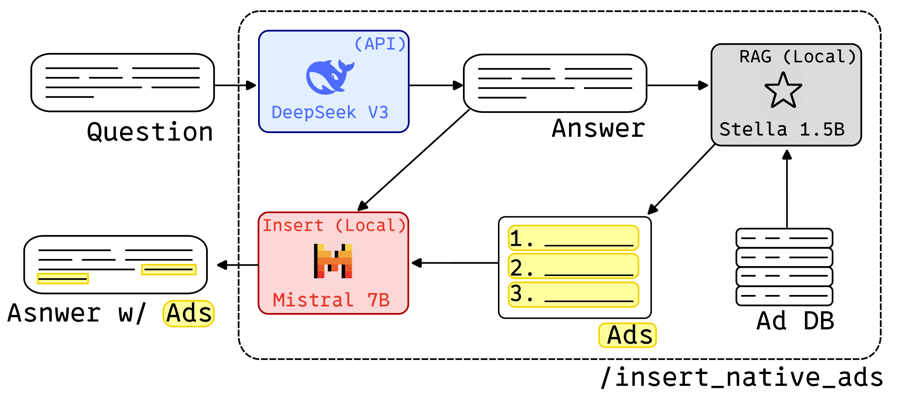

# A Framework for Seamless Advertising in LLM Responses
This repository provides a Flask-based server for running Large Language Models with integrated RAG (Retrieval-Augmented Generation) capabilities. The main API endpoint seamlessly integrates ads into LLMs outputs. This server combines:
- DeepSeek V3 API for text generation and inference. **NOT IMPLEMENTED YET**.
- Mistral 7B for advertisement integration. 
- Stella-en-1.5B for high-quality embeddings
- SQLite RAG database for semantic product search



## Installation

### 1. Create conda environment and install dependencies
```bash
conda env create -f environment.yml
conda activate llm-server
```
The server uses `llama-cpp-python` to serve models in the GGUF format. Building it from source may be necessary to enable CUDA support.

```bash
export CMAKE_ARGS="-DGGML_CUDA=on"
export FORCE_CMAKE=1
pip install llama-cpp-python --upgrade --force-reinstall --no-cache-dir
```

This will take a significant amount of time, as it builds the library from source.

---
¹ **Note**: If you encounter library loading errors during compilation, you may need to set the library path:
```bash
export LD_LIBRARY_PATH=/lib/x86_64-linux-gnu:/usr/lib/x86_64-linux-gnu:$LD_LIBRARY_PATH
```

### 2. Download models and datasets
The fastest way to download the models is to use the `huggingface-hub`. 
```bash
pip install huggingface-hub
huggingface-cli login
```
Run the following script to download the models:
```bash
cd models
source download.sh
```

Run the following script to download the datasets:
```bash
cd datasets
source python download.py
```

### 3. Configuration

Create `config.ini` and save it in the `Ads/` directory:

```ini
[server]
hostname = 0.0.0.0
port = 8888

[model]
path = models/mistral-7b-instruct-v0.3/Mistral-7B-Instruct-v0.3.Q4_K_M.gguf
max_tokens = 8096
gpu_device = 0

[embedding]
path = models/stella-en-1.5B
gpu_device = 0

[data]
csv_path = datasets/products.csv

[prompts]
qa_template_path = prompts/minimal_qa_template.txt
ad_with_url_insertion_template_path = prompts/ad_with_url_template.txt
ad_without_url_insertion_template_path = prompts/ad_without_url_template_path
```

Create `.env`: and save it in the `Ads/` directory:
```bash
DEEPSEEK_API_KEY=your_actual_api_key_here
```


## Usage

### Data Format

An example with common YouTube advertisements can be found [here](https://huggingface.co/datasets/HectorRguez/Common_yt_sponsors). The CSV should be tab-separated with these columns:

| Name | Category | Description |
|------|----------|-------------|
| NordVPN | VPN/Privacy | Established in 2012, NordVPN is renowned for its robust security features... |
| Surfshark | VPN/Privacy | Launched in 2018, Surfshark offers features like CleanWeb... |

### Starting the Server

```bash
python src/server.py
```

The server will automatically:
1. Load both AI models
2. Initialize the RAG database
3. Import products from CSV (skips duplicates)
4. Start the web server

### API Endpoints

#### Text Generation
- `POST /infer_local` - Generate text locally with Mistral 7B.
- `POST /insert_native_ads` - Insert native advertisements with Mistral 7B.

#### RAG & Products
- `GET /products` - List all products
- `POST /products` - Add new product
- `DELETE /products/<id>` - Delete product
- `POST /search` - Semantic search

#### System
- `GET /health` - Server health check

### Examples

```bash
python src/server_demo.py
```

This tests all functionality including:
- Text generation
- RAG search with various queries
- Ad integration

### Web UI (This section needs to be improved)
Open ssh tunnel:
```bash
ssh -L 8888:localhost:8888 user@server
```

In your browser, search `localhost:8888/`

## API Documentation

Interactive Swagger docs available at: `http://localhost:8888/apidocs/`

## Architecture

### Models
- **Mistral 7B**: Quantized GGUF format for efficient inference
- **Stella-en-1.5B**: 1536-dimensional embeddings optimized for retrieval

### Database Schema
```sql
CREATE TABLE products (
    id INTEGER PRIMARY KEY AUTOINCREMENT,
    name TEXT NOT NULL UNIQUE,
    category TEXT NOT NULL, 
    description TEXT NOT NULL,
    embedding BLOB NOT NULL
);
```

### Project Structure
```
src/
├── server.py              # Server setup and initialization
├── server_demo.py         # Test all the APIs
├── models.py              # Model loading and management
├── rag.py                 # RAG functionality (embeddings, database, search)
├── endpoints.py           # All API endpoints
├── prompts/               
├── datasets/              # Download and add advertisements to wildchat dataset
└── config.ini
```

### Reference datasets
- [**WildChat** advertisment preference dataset](https://huggingface.co/datasets/HectorRguez/wildchat-advertisement-placement-preference): Annotated dataset containing prompt/response pairs from the WildChat dataset with advertisements inserted. Each prompt is paired with two response variations and also has human preference annotations for DPO fine-tuning.
- [Corporate advertiser dataset](https://huggingface.co/datasets/HectorRguez/corp_advertisement_dataset): A dataset containing corporations and products commonly appearing in advertisments, especially advertisements appearing in YouTube videos. Includes a description, URL, and category for each.

# TRUE Benchmark Dataset Question Generation Strategy

To measure the impact of advertisement insertion on factual consistency, we use the [TRUE](https://github.com/google-research/true) benchmark as an estimate. This benchmark contains a number of text generation tasks and associated datasets and measures model consistency on each task. While this only indirectly measures consistency, to our knowledge there are no direct evaluation strategies for this metric.
